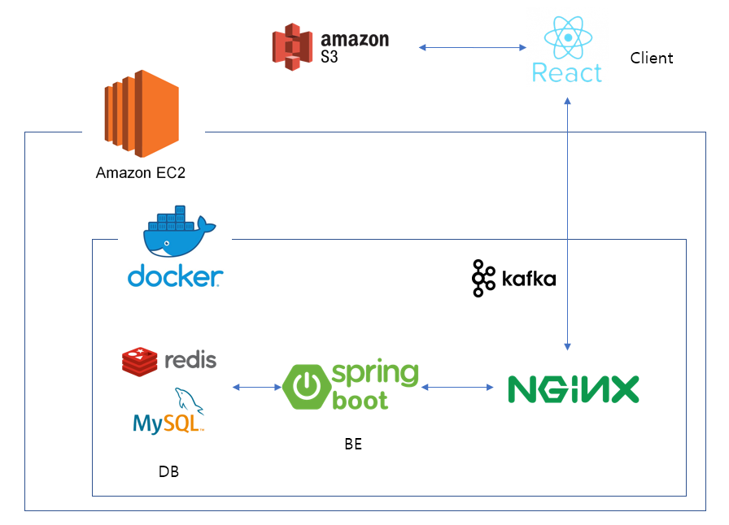

# 🌞 SUN 

**SUN**은 어린 학생들을 가르치는 과외 선생님을 위한 모바일 UI 기반의 캘린더 기반의 학습관리 웹 서비스입니다.

## :family_man_boy_boy: 팀원 소개

    

## :calendar: 개발 기간

- 2021년 10월 11일 ~ 2021년 11월 26일 (6주)

##  :open_file_folder: 서비스

### :movie_camera: UCC

    

### :scroll: Pages

#### 1. 로그인

    

#### 2. 회원가입

    

#### 3. 아이디 / 비밀번호 찾기

    

#### 4. 프로필

    

#### 5. 비밀번호 수정

    

#### 6. 캘린더

    

#### 7. 과제별 채팅

    

#### 8. 알림

    

#### 9. 채팅 알림

    

### :building_construction: 서비스 구조

    

##  :computer: 기술스택

    
기술스택 & 라이브러리

    <h4>FE</h4>
    <ul>
        <li>HTML</li>
        <li>CSS, SCSS</li>
        <li>JavaScript</li>
        <li>React</li>
        <li>SWR</li>
        <li>SockJS, STOMP client</li>
    </ul>
    <h4>BE</h4>
    <ul>
        <li>Spring boot</li>
        <li>MySQL</li>
        <li>Redis</li>
        <li>JPA</li>
        <li>JWT</li>
        <li>SSE(Server Sent Events)</li>
        <li>WebSocket</li>
        <li>Kafka</li>
        <li>S3</li>
    </ul>
    <h4>Infra</h4>
    <ul>
        <li>AWS EC2</li>
        <li>Docker</li>
        <li>Nginx</li>
        <li>Kubernetes</li>
    </ul>

## :hammer_and_wrench: 협업 툴

    
협업 툴

    <h4>협업 툴</h4>
    <ul>
        <li>Gitlab</li>
        <li>Jira</li>
        <li>Notion</li>
        <li>Gather Town</li>
    </ul>

## :speech_balloon: 기록들 

> [프로젝트 활동 기록(Notion)](https://www.notion.so/binitiger/SSAFY-fd747d28c47f448c874e01526b4349b2)
>
> [최종 발표](https://www.miricanvas.com/v/1q2282)

